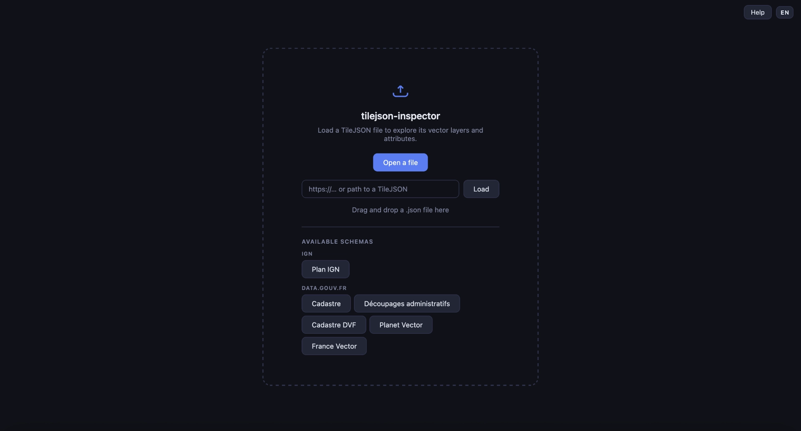
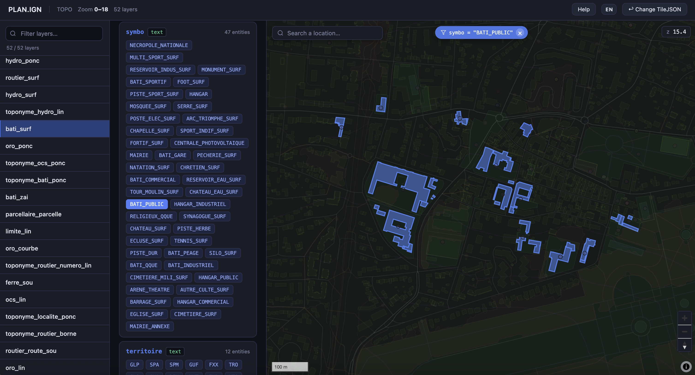

# TileJSON inspector

A TileJSON file inspection tool for exploring vector layers and their attributes.





## Use the inspector
[👉 inspect tileJSON and vector map](https://romainronflette.github.io/tilejson-inspector/)

## Run locally

The application requires a local HTTP server (fetches are blocked over `file://`).

```bash
npx serve .
```

or with Python:

```bash
python3 -m http.server 8080
```

Then open [http://localhost:8080](http://localhost:8080).
